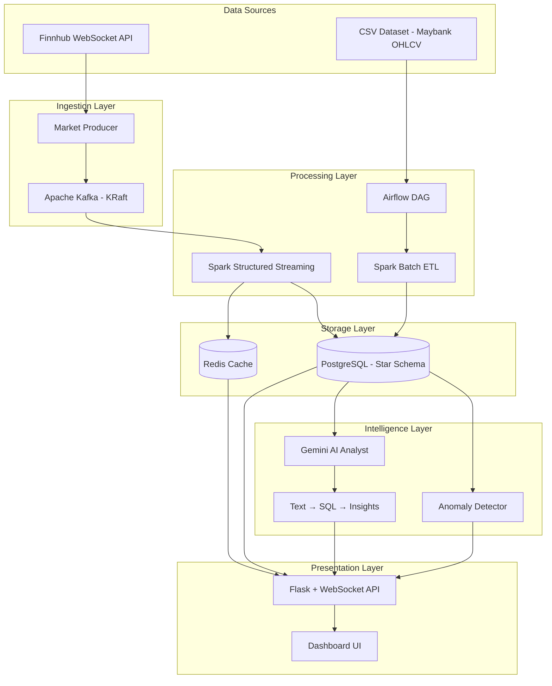

# MassMutual Financial Intelligence Platform

[](https://github.com/massmutual/financial-pipeline/actions)


> **Real-time financial analytics platform with AI-powered natural language querying** for Maybank (1155.KL) on the KLSE market. Combines batch ETL, streaming ingestion, and Gemini-powered conversational analysis in a containerized microservices architecture.

---

## Highlights

- 🤖 **AI Financial Analyst** — Ask questions in plain English, get data-backed analysis with auto-generated charts
- 📡 **Real-Time Streaming** — Finnhub WebSocket → Kafka → Spark Streaming → Redis → WebSocket Dashboard
- 📊 **Star Schema Analytics** — Batch ETL with Airflow + Spark into dimensional PostgreSQL warehouse
- 🎨 **Premium Dashboard** — Glassmorphism UI with live candlestick charts, anomaly alerts, and AI chat
- ⚡ **Anomaly Detection** — Statistical Z-score engine for volume spikes and price anomalies
- 🔒 **Production-Hardened** — Connection pooling, rate limiting, API auth, CORS, non-root containers

---

## Architecture



## Tech Stack

| Layer | Technology | Purpose |
|---|---|---|
| **Message Broker** | Apache Kafka 3.7 (KRaft) | Real-time event streaming |
| **Stream Processing** | Spark Structured Streaming 3.5 | Real-time data transformation |
| **Batch ETL** | Apache Spark + Airflow 2.9 | Scheduled data pipeline orchestration |
| **Database** | PostgreSQL 15 (Star Schema) | Dimensional data warehouse |
| **Cache** | Redis 7 (authenticated, persistent) | Hot-path price cache |
| **API Server** | Flask + Gunicorn + SocketIO | REST API + WebSocket server |
| **AI Engine** | Google Gemini 2.5 Flash | Natural language → SQL → Analysis |
| **Frontend** | Chart.js + TradingView Lightweight Charts | Interactive financial visualizations |
| **Containerization** | Docker Compose | Multi-service orchestration |
| **CI/CD** | GitHub Actions | Lint, test, build validation |

## Quick Start

### Prerequisites

- Docker & Docker Compose v2+
- [Finnhub API Key](https://finnhub.io/) (free — optional, simulation mode available)
- [Gemini API Key](https://aistudio.google.com/) (free — required for AI features)

### 1. Clone & Configure

```bash
git clone <repo-url> && cd MassMutual
cp .env.example .env
# Edit .env and set your API keys:
#   FINNHUB_API_KEY=your_key_here
#   GEMINI_API_KEY=your_key_here
```

### 2. Start Services

```bash
# Option A: Use bootstrap script
chmod +x scripts/bootstrap.sh
./scripts/bootstrap.sh

# Option B: Manual
docker compose up -d
```

### 3. Access

| Service | URL | Credentials |
|---|---|---|
| **Dashboard** | [http://localhost:5000](http://localhost:5000) | — |
| **AI Analyst** | Dashboard → AI tab | Requires Gemini API key |
| **Airflow UI** | [http://localhost:8080](http://localhost:8080) | admin / admin |
| **Spark UI** | [http://localhost:8081](http://localhost:8081) | — |

## AI Financial Analyst

Ask natural language questions about the financial data:

```
"What was the most volatile month in 2023?"
"Show me the correlation between GDP and stock price"
"What is the average daily return by year?"
"Which quarter had the highest trading volume?"
```

The AI analyst:
1. Interprets your question using Gemini
2. Generates a safe SQL query (SELECT only)
3. Executes against the star schema
4. Returns human-readable analysis + auto-generated chart

See [docs/AI_ANALYST.md](docs/AI_ANALYST.md) for details.

## Database Schema (Star Schema)

```
┌──────────────┐     ┌────────────────────┐     ┌────────────────┐
│   dim_date   │────▶│ fact_daily_prices   │◀────│   dim_stock    │
│──────────────│     │────────────────────│     │────────────────│
│ date_key PK  │     │ fact_id PK         │     │ stock_id PK    │
│ date         │     │ date_key FK        │     │ ticker         │
│ day, month   │     │ stock_id FK        │     │ company_name   │
│ quarter, year│     │ OHLCV, returns     │     │ sector, market │
│ weekday      │     │ GDP, inflation     │     └────────────────┘
└──────────────┘     └────────────────────┘
       │                                              │
       │         ┌────────────────────┐               │
       ├────────▶│ fact_volatility    │◀──────────────┤
       │         │ rolling_7d, 30d    │               │
       │         └────────────────────┘               │
       │         ┌────────────────────┐               │
       └────────▶│ fact_monthly_summ  │◀──────────────┘
                 │ avg_close, vol     │
                 └────────────────────┘
```

See [docs/DATA_DICTIONARY.md](docs/DATA_DICTIONARY.md) for full schema documentation.

## Environment Variables

| Variable | Required | Default | Description |
|---|---|---|---|
| `FINNHUB_API_KEY` | No | — | Finnhub API key (simulation mode if missing) |
| `GEMINI_API_KEY` | No | — | Google Gemini API key for AI analyst |
| `APP_DB_PASSWORD` | Yes | `massmutual123` | PostgreSQL application database password |
| `REDIS_PASSWORD` | Yes | `massmutual_redis` | Redis authentication password |
| `API_SECRET_KEY` | No | — | API key for endpoint authentication |

See `.env.example` for the complete list.

## Development

### Running Tests

```bash
# Install test dependencies
pip install -r frontend/requirements.txt pytest pytest-cov

# Unit tests
pytest tests/unit -v -m unit

# Data quality tests
pytest tests/data_quality -v -m data_quality

# Integration tests (requires running DB)
docker compose up -d postgres
pytest tests/integration -v -m integration

# All tests
pytest tests/ -v
```

### Pre-commit Hooks

```bash
pip install pre-commit
pre-commit install
pre-commit run --all-files
```

### Project Structure

```
MassMutual/
├── frontend/               # Flask API + Dashboard
│   ├── app.py              # REST API + WebSocket server
│   ├── ai_analyst.py       # Gemini AI natural language analyst
│   ├── anomaly_detector.py # Statistical anomaly detection
│   ├── templates/          # HTML templates
│   └── static/             # CSS, JS assets
├── streaming/              # Real-time data ingestion
│   └── producer.py         # Finnhub → Kafka producer
├── spark/                  # Data processing
│   ├── spark_pipeline.py   # Batch ETL (idempotent)
│   └── stream_consumer.py  # Kafka → PostgreSQL + Redis
├── airflow/                # Orchestration
│   └── dags/               # DAG definitions
├── db/                     # Database initialization
│   ├── 01_create_db.sql    # DB + role creation
│   └── 02_create_tables.sh # Star schema + AI tables
├── data/                   # Source datasets
├── tests/                  # Test suite
│   ├── unit/               # Unit tests
│   ├── integration/        # DB integration tests
│   └── data_quality/       # Data contract validation
├── docs/                   # Documentation
├── scripts/                # Utility scripts
├── docker-compose.yml      # Service orchestration
└── .github/workflows/      # CI/CD pipeline
```

## Troubleshooting

| Issue | Solution |
|---|---|
| Kafka won't start | Wait 30s after `docker compose up`. Check: `docker logs mm_kafka` |
| Spark job fails | Check JDBC driver exists: `docker exec mm_spark_worker ls /opt/spark/jars/postgresql*` |
| AI returns "not configured" | Set `GEMINI_API_KEY` in `.env` and restart frontend |
| Dashboard shows "—" | Run the Airflow DAG first to populate the star schema |
| Redis connection refused | Verify `REDIS_PASSWORD` matches in `.env` and `docker-compose.yml` |

## Security

See [SECURITY.md](SECURITY.md) for security policy and vulnerability reporting.

## Contributing

See [CONTRIBUTING.md](CONTRIBUTING.md) for developer guidelines.

## License

This project is licensed under the MIT License.
